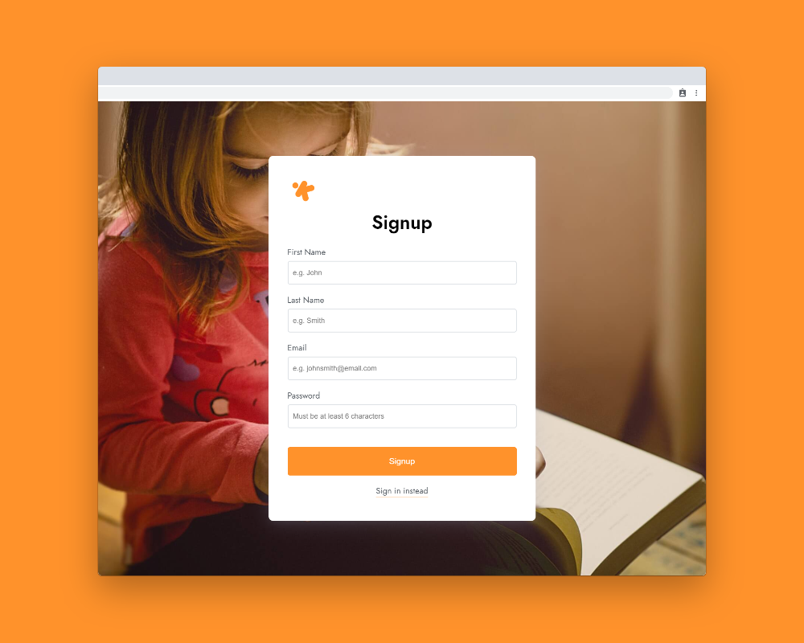
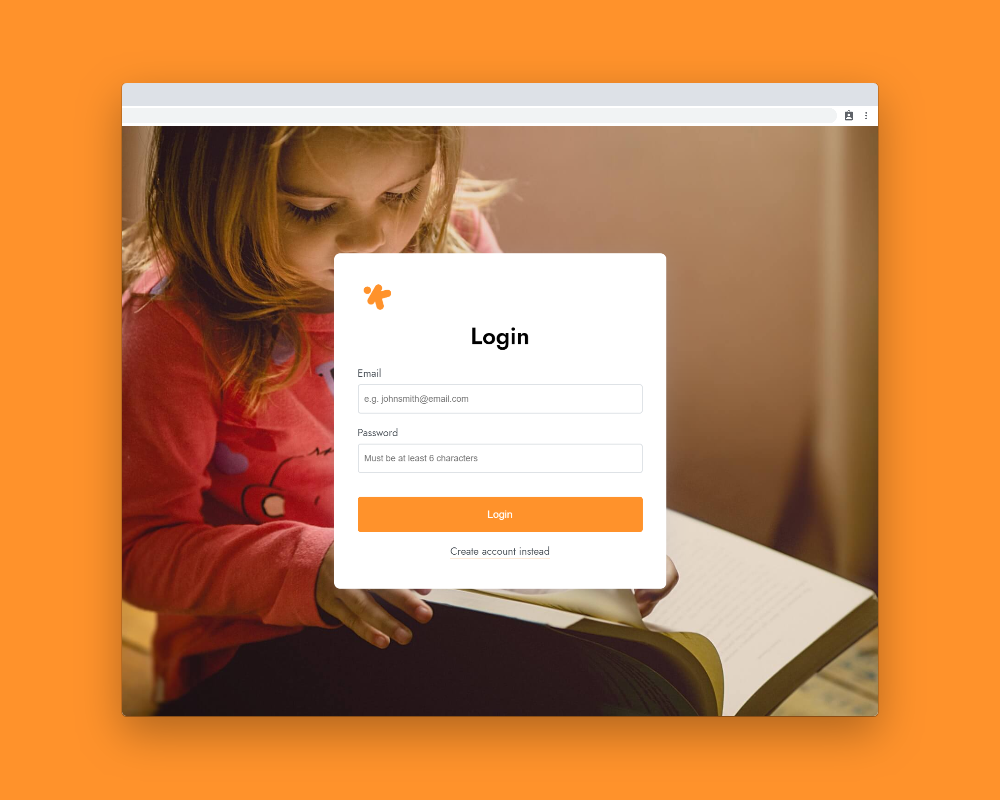

[](https://kbank.now.sh/)

# KBank &middot; [](./LICENSE) [](https://github.com/npathapp/kbank/pulls)

`KBank` is a web application to teach kids about financial literacy and responsibility.


## 📖 Table of Contents

* [📢 About](#📢-about)
* [🎯 Introduction](#🎯-introduction)
* [📷 Screenshots](#📷-screenshots)
  * [Login page](#login-page)
  * [Signup page](#signup-page)
* [🚀 Getting Started](#🚀-getting-started)
  * [Cloning the project](#cloning-the-project)
  * [Running the client](#running-the-client)
  * [Running the server](#running-the-server)
  * [Running both](#running-both)
* [💻 Technologies](#💻-technologies)
* [📄 License](#📄-license)
* [😉 Acknowledgement](#😉-acknowledgement)


## 📢 About

* **University:** San Jose State University
* **Course:** Enterprise Software - CMPE172 (Spring 2020)
* **Team Members:** Jasmine Mai, Nhat Nguyen, and Albert Ong


## 🎯 Introduction

Many parents give their children an allowance. Some parents give weekly or monthly allowance for free. Or, if they make their children do chores to earn allowance, they sometimes lose track of what’s been completed and how much the children earned. With KBank (kids bank), parents can add available chores. Parents will set the allowance reward for each one.

The children will look at the list and choose which ones they want to do. If the children completes the chore, the reward will be added to their total rewards that can be claimed later. KBank application is a win-win for both parents and children! Children can earn an allowance and parents can manage their allowance.


## 📷 Screenshots

### Signup page
[](https://kbank.now.sh/)

### Login page
[](https://kbank.now.sh/)


## 🚀 Getting Started

### Cloning the project

```bash
# clone project
git clone https://github.com/npathapp/kbank.git

# navigate to project
cd kbank
```

### Running the client

```bash
# navigate to client
cd client

# installing the client
npm install

# running the client
npm run dev
```

### Running the server

```bash
# navigate to server
cd server

# installing the server
npm install

# running the server
npm run dev
```

### Running both

```bash
# navigate to server directory
cd server

# installing the server
npm install

# navigate to client directory
cd ../client

# installing the client
npm install

# Running the project
npm start
```


## 💻 Technologies

**Design**
* [Figma](https://www.figma.com/) // Interface Design Tool
* [Inkscape](https://inkscape.org/) // Vector Graphics Tool

**Frontend**
* HTML
* CSS
  * [Sass](https://sass-lang.com/) // CSS Preprocessor
* JavaScript
  * [React](https://reactjs.org/) // JavaScript Library
  * [axios](https://github.com/axios/axios) // HTTP Client
* [Parcel](https://parceljs.org/) // Web Application Bundler
  * [parcel-plugin-inliner](https://github.com/shff/parcel-plugin-inliner) // Inline CSS and JS in HTML

**Backend**
* [Node](https://nodejs.org/en/)
  * [Express](https://expressjs.com/) // Node framework
* [Postgres](https://www.postgresql.org/) // Advanced Open Source Database
* [Docker](https://www.docker.com/) // Containers

**DevOps**
* [Amazon RDS](https://aws.amazon.com/rds/) // Distributed Relational Database Service
* [Amazon ECS](https://aws.amazon.com/ecs/) // Container Orchestration Service
* [Git](https://git-scm.com/) // Distributed Version Control System
  * [GitHub](https://github.com/) // Git Repository Hosting Service
* [Visual Studio Code](https://code.visualstudio.com/) // Code Editor


## 📄 License

All parts of this project are free to use and abuse under the open-source [MIT license](./LICENSE).


## 😉 Acknowledgement

Written by [Jasmine Mai](https://github.com/jasminemai97), [Nhat Nguyen](https://github.com/nguyen-nhat), and [Albert Ong](https://github.com/Albert-C-Ong).
